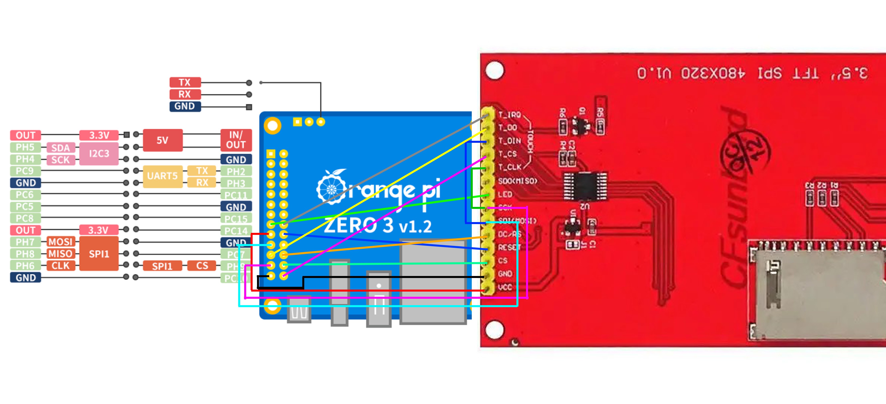
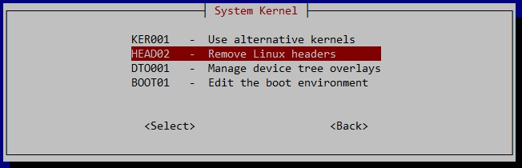

# Подключение дисплея ili9488 к OrangePi Zero 3

| LCD	| OrangePi	|
|---|---|
|T_IRQ|PC15|
|T_DO|PH8|
|T_DIN|LCD_SDI|
|T_CS|PC10|
|T_CLK|LCD_SCK|
|||
|LED|PC8|
|SCK (SPI CLOCK)|PH6|
|SDI (LCD MOSI)|PH7 (OPIZ MOSI)|
|LCD DC (DATA/CONTROL)|PC7|
|LCD RESET|PC14|
|CS (CHIP SELECT)|PH9|
|GND|GND PIN 20|
|VCC|3.3V|

# Распиновка платы дисплея
Для подключения платы дисплея, использовал такой принцип



# Установка драйвера дисплея в Armbian
Сначала определим какую версию ядра мы используем:
```
pi@orangepizero3:~$ uname -r
6.12.35-current-sunxi64
```
Если версия 6.12.35 можно попробовать взять готовый драйвер **fb_ili9488.ko** и скопировать его себе

```
git clone https://github.com/vkoshkarov/fb_ili9488.git
cd fb_ili9488/kernel_module
sudo cp fb_ili9488.ko /lib/modules/$(uname -r)/kernel/drivers/staging/fbtft
```
и перейти к пункту установки оверлея. Если не помогло придется собирать драйвер под свою систему.

# Сборка драйвера
За основу были взяты нароботки [trambouter](https://github.com/trambouter/fb_st7796s_lerdge.git)
Так же был заменен файл __fbtft.h__ - свежий файл был взят отсюда (https://elixir.bootlin.com/linux/v6.12.35/source/drivers/staging/fbtft)

Для сборки модуля понадобится пакеты build-essential и linux-headers.
так же рекомендуется установить пакет pahole без него скомпилированные драйвера не соответствовали ядру
```
sudo apt install build-essential pahole -y
```
linux-headers лучше устанавливать из меню armbian-config


```
apt list --installed | grep linux-headers
```

Cоберем драйвер:
```
cd ~/fb_ili9488/kernel_module/
make clean
make
sudo make install
sudo depmod -A
```
Дальше нам необходимо будет указать ядру как работать с этим драйвером, для этого будем использовать пользовательские overlays.

# Установка оверлея
Перейдем в директорию dts:
```
cd ../dts/
ls 
sudo armbian-add-overlay ili9488-ads7846.dts
sudo reboot
```

Если после перезагрузки на экране ничего не появилось, читайте логи
```
dmesg | grep -i "fbtft\|spi\|drm\|ili9488"
```

Проверить работу тачскрина можно командой
```
sudo apt install evtest
sudo evtest
```

В dts файле можно попровать изменить spi-max-frequency, этот параметр указывает на какой частоте будет работать дисплей. На 10мгц работает медленно, но для klipperscreen хватает. На 30мгц - уже очень комфортно работать с дисплеем.

Частоту контроллера тача лучше не поднимать выше 1мгц, замечена нестабильная работа.


# Настройка Xorg и KlipperScreen
Сначала установим KlipperScreen через kiauh.

Копируем файл /conf/99-fbdev.conf в /usr/share/X11/xorg.conf.d/ (или в /etc/X11/xorg.conf.d/)
```
cd ../conf/
sudo cp 99-fbdev.conf /usr/share/X11/xorg.conf.d
```

После перезагрузки экран завелся автоматически. Если у вас не так, дальнейшую настройку посмотрите у [trambouter](https://github.com/trambouter/fb_st7796s_lerdge.git)

При необходимости можно произвести калибровку тача, сначала узнаем id устройства:

```
pi@orangepizero3:~$ sudo apt install xinput-calibrator
pi@orangepizero3:~$ DISPLAY=:0 xinput_calibrator --list
Device "ADS7846 Touchscreen" id=6
```

В нашем случаe id=6, запускаем калибровку:
```
DISPLAY=:0 sudo xinput_calibrator --device 6 --output-type xorg.conf.d  --output-filename /etc/X11/xorg.conf.d/99-calibration.conf
```

Результат калибровки запишется в __/etc/X11/xorg.conf.d/99-calibration.conf__, потребуется только перезапустить KlipperScreen для применения параметров:
```
sudo systemctl restart KlipperScreen.service
```

Если при выполнении команды _DISPLAY=:0 xinput_calibrator --list_ возникает ошибка, смотрите логи __/var/log/Xorg.0.log__
```
Failed to load /usr/lib/xorg/modules/input/libinput_drv.so: libinput.so.10: cannot open shared object file: No such file or directory
```
Если там есть такое сообщение потребуется переустановка __libinput__
```
sudo apt update
sudo apt install --reinstall libinput10 libinput-bin xserver-xorg-input-libinput
```
Проверьте наличие файлов:
```
ls -l /usr/lib/xorg/modules/input/libinput_drv.so
ldd /usr/lib/xorg/modules/input/libinput_drv.so | grep libinput.so.10
```